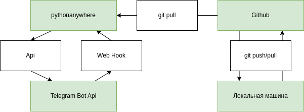

# Описание
Простой бот для телеграм выполняющий функцию эхо сервера - любой текст который будет отправлен боту будет отправлен обратно в перевернутом виде

Для тестирования бота использовалась бесплатная версия https://www.pythonanywhere.com/

# CI/CD


# Настройка
## Создание бота
Создайте телеграм бота и установите webhook

### Посмотреть установленные webhook
https://api.telegram.org/bot{TG_TOKEN}/getWebhookInfo

### Установить webhook
https://api.telegram.org/bot{TG_TOKEN}/setWebhook?url={WEB_HOOK_URL}

### Удалить webhook
https://api.telegram.org/bot{TG_TOKEN}/setWebhook?url={WEB_HOOK_URL}

## Config бота
Скопируйте `config_env_default.json` в `config_env.json`
Отредактируйте файл `config_env.json `согласно ваших данных
```
{
    "tg_token": "",
    "db" : {
        "host": "",
        "db": "",
        "passwd": "",
        "user": ""
    }
}
```
